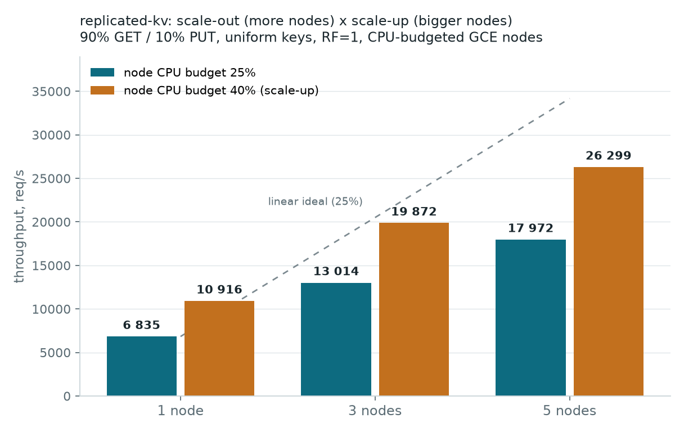

# replicated-kv

A replicated, in-memory key-value store built for the TU Berlin **Scalability
Engineering** (Summer Semester 2026) prototyping assignment. It demonstrates
horizontal and vertical scaling, hand-implemented overload mitigation, and
quorum replication with a clean stateless/stateful split.

> **Status — built layer by layer.** Each layer compiles, runs, and passes its
> tests before the next begins. See [Build status](#build-status).

## Architecture (target)

```
                 client (k6)
                     |
            +--------v---------+   stateless: holds the hash ring only.
            |   Router/Coord   |   Computes the preference list per key,
            | (stateless tier) |   runs quorum read/write, reconciles (LWW).
            +--------+---------+
       forward by hash(key) to the N replicas in the preference list
        +------------+------------+------------+
   +----v----+  +----v----+  +----v----+  +----v----+
   | storage |  | storage |  | storage |  | storage |  stateful: each owns a
   |  node   |  |  node   |  |  node   |  |  node   |  slice of the keyspace
   +---------+  +---------+  +---------+  +---------+  in a sharded in-memory map.
```

- **Router** = stateless coordinator. Restart-safe, horizontally scalable.
- **Storage node** = stateful replica. Owns partitions of the keyspace.

Membership is **static**: the full node list is injected at deploy time. No
gossip / dynamic discovery (a deliberate scope limit, documented on the
limitations slide).

## Build status

| Layer | Scope | Status |
|------:|-------|:------:|
| 1 | Standalone storage node — sharded in-memory store + internal HTTP API | ✅ |
| 2 | Router + consistent-hash ring + forwarding (RF=1) | ✅ |
| 3 | Replication + quorum + LWW reconcile + read-repair | ✅ |
| 4 | Load shedding (overload mitigation) | ✅ |
| 5 | Retries (backoff + jitter) + read-through cache | ✅ |
| 6 | Terraform deploy (1 / 3 / 5 nodes) | ✅ |
| 7 | k6 benchmark + scaling graph | ✅ |

## Layer 1 — standalone storage node

The stateful tier in isolation: one node, an in-memory store with last-writer-
wins (LWW) versioning, and the internal HTTP API. No ring, no replication yet.

### Store semantics

- Keyspace striped across 32 independently-locked shards (FNV-1a of the key) so
  writers to different keys do not contend on a single lock.
- Each value carries the timestamp it was written at. `Put` applies a write iff
  its timestamp is newer than the stored one — or equal, with a
  lexicographically-greater value (a deterministic tie-break so replicas
  converge regardless of write arrival order).

### Internal HTTP API (called by the router only)

| Method | Path | Body | Responses |
|--------|------|------|-----------|
| `GET` | `/internal/get/{key}` | — | `200 {value,timestamp}` · `404` |
| `PUT` | `/internal/put/{key}` | `{value,timestamp}` | `200 {applied}` · `400` |
| `GET` | `/healthz` | — | `200` |

### Run it

```sh
# from the repo root
go test -race ./...                       # unit tests (race detector on)
go vet ./...
go build -o bin/storage ./cmd/storage

KV_ADDR=:8080 ./bin/storage               # start a node

curl -s -XPUT localhost:8080/internal/put/foo \
  -d '{"value":"bar","timestamp":1}'      # -> {"applied":true}
curl -s localhost:8080/internal/get/foo   # -> {"value":"bar","timestamp":1}
curl -s localhost:8080/healthz            # -> {"status":"ok"}
```

## Layer 2 — router + ring + forwarding (RF=1)

The stateless tier. The router owns a consistent-hash ring (150 virtual nodes
per physical node, SHA-256 placement) and forwards each client request to the
single node responsible for the key. It assigns the write timestamp, so LWW has
one clock per write path. No replication yet (RF=1).

### Client-facing HTTP API (on the router)

| Method | Path | Body | Responses |
|--------|------|------|-----------|
| `GET` | `/kv/{key}` | — | `200 {value,timestamp}` · `404` · `504` (no quorum) |
| `PUT` | `/kv/{key}` | `{value}` | `200` · `400` · `413` (value > 1 MiB) · `504` (no quorum) |
| `GET` | `/healthz` | — | `200` |

### Run it (1 router + 3 storage nodes, locally)

```sh
go build -o bin/router ./cmd/router
go build -o bin/storage ./cmd/storage

KV_ADDR=:19001 ./bin/storage &
KV_ADDR=:19002 ./bin/storage &
KV_ADDR=:19003 ./bin/storage &
KV_ADDR=:19000 KV_NODES=127.0.0.1:19001,127.0.0.1:19002,127.0.0.1:19003 ./bin/router &

curl -s -XPUT localhost:19000/kv/apple -d '{"value":"apple-v"}'  # -> 200
curl -s localhost:19000/kv/apple    # -> {"value":"apple-v","timestamp":...}
```

`KV_NODES` is the static membership list (comma-separated `host:port`), injected
at deploy time. `KV_ADDR` defaults to `:8080`.

## Layer 3 — replication + quorum + read-repair

Dynamo-style quorum replication:

- **PUT**: the router assigns the timestamp, fans the write out to all **RF**
  replicas of the key (from the ring's preference list) and replies once **W**
  have acked; stragglers keep applying the write in the background. Fewer than
  W acks → `504`.
- **GET**: fans out to all RF replicas, replies once **R** have answered, and
  returns the newest version among them (LWW: timestamp, then value bytes —
  the same total order the replicas converge to). A replica's "not found"
  counts toward R. Fewer than R answers → `504`.
- **Read-repair**: replicas observed stale/missing during a read are healed
  asynchronously with the winning version. Opportunistic: with R < RF only
  replicas that answered within the quorum window are repaired, so a restarted
  node heals within a few reads, not necessarily the first.

### Quorum configuration

Defaults derive from the node count — the assignment's three configs need no
explicit tuning:

| Config | nodes | RF | W | R |
|--------|-------|----|---|---|
| single | 1 | 1 | 1 | 1 |
| 3-node | 3 | 3 | 2 | 2 |
| 5-node | 5 | 3 | 2 | 2 |

`W+R > RF` → a read quorum always overlaps the newest committed write.
Override with `KV_RF` / `KV_W` / `KV_R` (validated: `1 ≤ W,R ≤ RF ≤ nodes`).

Note: reads contact all RF replicas and wait for the fastest R, so replication
trades read throughput for availability. Throughput scaling benchmarks run
with `KV_RF=1` (pure sharding); replication is the fault-tolerance demo.

### Fault-tolerance demo (RF=3, W=2, R=2)

```sh
# cluster up (see Layer 2), then:
curl -XPUT localhost:19000/kv/alpha -d '{"value":"a1"}'   # replicated to all 3
kill -9 <pid of one storage node>
curl localhost:19000/kv/alpha                             # still 200 (R=2)
curl -XPUT localhost:19000/kv/beta -d '{"value":"b1"}'    # still 200 (W=2)
# restart the killed node (empty) — a few reads later read-repair has healed it:
curl localhost:19002/internal/get/alpha                   # 200 again
```

## Layer 4 — load shedding (overload mitigation)

Hand-implemented (assignment requirement: no rate-limiting libraries) in
`internal/shed`: a counting semaphore bounds concurrent requests, a bounded
queue absorbs bursts, and anything beyond both is answered **503 immediately**
instead of joining an unbounded backlog. Refusing excess work keeps the node's
latency flat under any overload — the alternative (queueing everything) melts
into timeouts and OOM.

- **Storage nodes** shed on the internal data endpoints — the stateful tier
  can never be overwhelmed by router fan-in.
- **Router** sheds at the client-facing edge, before any fan-out work.
- `/healthz` bypasses shedding on both tiers: a saturated node is overloaded,
  not dead.
- The router counts a replica's 503 as a quorum failure (same as a dead node),
  so a saturated replica degrades into the standard quorum story: tolerated up
  to `RF−W` / `RF−R`, then `504` to the client.

Tuning: `KV_SHED_CONCURRENT` / `KV_SHED_QUEUE` (defaults: storage 256/512,
router 1024/1024).

Measured under a 100-VU k6 hammer against one storage node deliberately
limited to a single slot (`KV_SHED_CONCURRENT=1 KV_SHED_QUEUE=0`):

```
status_200: 318k (63.7k/s)    status_503: 147k (29.3k/s, shed)
p95 = 2.43ms  max = 36.8ms    ← same p95 as an unloaded run: no queue buildup
```

The node kept serving, health checks stayed green, and the latency of
*admitted* requests did not degrade — overload cost the excess callers a 503,
not everyone a timeout.

## Layer 5 — retries + read-through cache (the two extra strategies)

Both hand-implemented (assignment requirement 4).

**Retries with exponential backoff and full jitter** (`internal/retry`):
router→replica calls retry transient failures — connection refused, timeouts,
`503` from a shedding node — up to 3 attempts, sleeping `rand(0, 50ms·2^n)`
capped at 1s between tries. Full jitter prevents synchronized retriers from
reproducing the burst that shed them. Deterministic failures (4xx) are marked
`Permanent` and never retried. Retrying is safe because both internal ops are
idempotent: a re-sent PUT carries the same key/timestamp/value and LWW
deduplicates it.

**Read-through LRU+TTL cache** (`internal/cache`, on the router): a GET
checks the cache first — a hit answers without any quorum fan-out; a miss
does the quorum read and populates. A successful PUT invalidates the key, so
each router reads its own writes. Config: `KV_CACHE_SIZE` (entries, 0
disables; default 4096) and `KV_CACHE_TTL` (default 1s).

Hot-key measurement (50 VUs, one key, local 3-node cluster):

| | ops/s | avg | p95 |
|---|---|---|---|
| cache off | 3 292 | 15.15ms | 39.3ms |
| cache on | 98 248 | 477µs | 1.05ms |

**Known limitation** (deliberate): the cache is per-router. With several
routers, a write through router A leaves router B's cached copy stale until
its TTL expires — cross-router staleness is bounded by `KV_CACHE_TTL`, not
eliminated.

## Layer 6 — deploy to GCP (Terraform)

Topology per apply: `node_count` storage VMs + 1 router VM (same machine type,
as the assignment requires for the 1/3/5 comparison) + 1 beefier k6 loadgen VM,
all in one subnet. Membership is static: internal IPs are fixed in Terraform
before the VMs exist, so every startup script receives the full node list.
Binaries are cross-compiled locally, shipped through a GCS bucket, and run
under systemd.

### One-time setup

```sh
brew install --cask gcloud-cli terraform   # if missing
gcloud auth login                          # account holding the course credit
gcloud auth application-default login      # credentials for Terraform
gcloud projects create <PROJECT_ID>        # or reuse an existing project
# link the project to the billing account with the course credit (Console → Billing),
# then:
gcloud services enable compute.googleapis.com --project <PROJECT_ID>
```

### Deploy (a: 1 node, b: 3 nodes, c: 5 nodes)

```sh
# build the linux binaries the VMs will run
CGO_ENABLED=0 GOOS=linux GOARCH=amd64 go build -o bin/linux_amd64/storage ./cmd/storage
CGO_ENABLED=0 GOOS=linux GOARCH=amd64 go build -o bin/linux_amd64/router ./cmd/router

cd deploy/terraform
terraform init
terraform apply -var project=<PROJECT_ID> -var node_count=3   # 1 | 3 | 5

# smoke test (also printed as the `smoke_test` output):
curl -s -XPUT http://$(terraform output -raw router_public_ip):8080/kv/hello -d '{"value":"world"}'
curl -s http://$(terraform output -raw router_public_ip):8080/kv/hello

terraform destroy -var project=<PROJECT_ID>   # ALWAYS after a session — the credit is finite
```

Useful variables (see `variables.tf`): `machine_type` (bonus scale-up runs),
`kv_rf/kv_w/kv_r` (`-var kv_rf=1` for the pure-sharding throughput benchmark),
`kv_shed_*` (overload-demo tuning), `client_cidr` (lock the public port down
to your IP).

Cost: the full 5-node farm (7 × e2-class VMs) is ≈ $0.17/h — a two-hour
benchmark session costs ~$0.35 of the $50 credit. The expensive failure mode
is forgetting `terraform destroy`, not running benchmarks.

## Layer 7 — benchmarks: the scaling curve



| Nodes | Throughput | Scaling | p99 | Control run delta |
|------:|-----------:|--------:|----:|------------------:|
| 1 | 6 835 req/s | ×1.00 | 101 ms | 0.7% |
| 3 | 13 014 req/s | ×1.90 | 89 ms | 1.2% |
| 5 | 17 972 req/s | ×2.63 | 88 ms | 4.3% |

Workload: 90% GET / 10% PUT over 100k uniformly random keys (a hot key would
pin its load to one node and flatten the curve), RF=1 — pure sharding;
replication is the fault-tolerance demo, not the throughput number. k6 runs
from a VM inside the VPC against the router's internal IP.

### Methodology (what it took to get noise-free numbers)

- **Dedicated-core nodes with a fixed CPU budget.** Storage nodes are
  n1-standard-1 with the service cgroup-capped at `CPUQuota=25%`. Shared-core
  E2 machines made results depend on their burst-credit state (the same
  3-node setup measured 7.3k and 11.7k req/s in different runs); a dedicated
  core with a fixed quota is deterministic. GCP sells no dedicated machine
  smaller than 1 vCPU, so the "small node" is emulated in systemd.
- **Keyspace pre-seeded before measuring.** Without it, GETs start as cheap
  404s and get more expensive as PUTs fill the store — throughput drifts for
  minutes. `bench/k6/seed.js` writes all 100k keys first.
- **Every point is verified by a control run**: a second, independent 60s
  window must agree with the first (deltas above). A >5% disagreement means
  not-steady-state and the point is discarded.
- **Nothing else may be the bottleneck**: router and loadgen are e2-standard-8
  (measured single-router ceilings: e2-small 7.3k, e2-standard-2 10k req/s —
  an equal-hardware coordinator caps the whole cluster below one node's
  capacity, because a routed request costs ~2.5x a storage request). The
  runner asserts the CPU quota is live on the nodes before each measurement.
- **Offered load sits at the throughput peak.** VUS=300 saturates every
  configuration; pushing harder degrades goodput (5 nodes: 18.0k at 300 VUs,
  14.4k at 600, 12.3k at 900) — queueing overhead, not extra capacity.

### Bonus: scale-up × scale-out

The same three configurations, re-run with each node's CPU budget raised from
25% to 40% (`CPU_QUOTA=40%`) — vertical scaling along the exact axis that
defines node size in this setup:

| Nodes | 25% budget | 40% budget | Scale-up gain |
|------:|-----------:|-----------:|--------------:|
| 1 | 6 835 req/s | 10 916 req/s | ×1.60 |
| 3 | 13 014 req/s | 19 872 req/s | ×1.53 |
| 5 | 17 972 req/s | 26 299 req/s | ×1.46 |

The single-node gain (×1.60) matches the budget increase (40/25 = 1.6)
exactly, validating that node throughput is CPU-bound and the budget is the
real knob. Control-run deltas: 0.4% / 0.1% / 2.7%.

Note: the bonus set ran in `europe-west4` (n1-standard-1 was stocked out
across all `europe-west3` zones at the time — `REGION`/`ZONE` are variables
precisely for this). The exact ×1.60 single-node ratio confirms per-core
parity between the regions.

### Reproduce

```sh
for n in 1 3 5; do ./bench/run.sh $n <PROJECT_ID>; done   # ~7 min per point
# bonus scale-up set:
for n in 1 3 5; do CPU_QUOTA=40% VUS=450 OUT_DIR=bench/results/scaleup ./bench/run.sh $n <PROJECT_ID>; done
python3 bench/plot.py                                     # renders the chart
```

Each run deploys the configuration from scratch, seeds, measures, verifies,
collects `bench/results/nodes-N.json` and destroys the deployment.

## License

[MIT](LICENSE).
